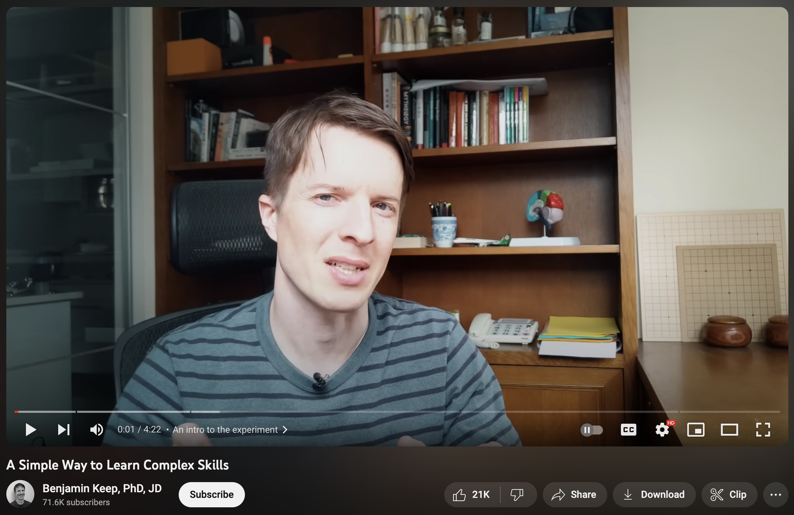
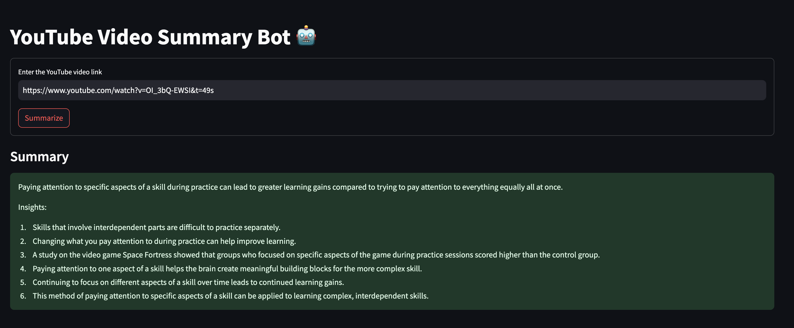
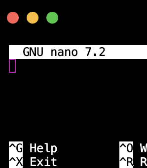

# [**YouTube Summarizer**](https://youtubesummary.streamlit.app/) | 🎬🎥🔴 ---> 📝

^streamlit community cloud edition

## ❓ | Motivation 

You see a colorful array of thumbnails. 

You open a bunch of tabs. 

So many tabs...

so little time. 

In the past, you might've swept through comments-first, *hoping* for a gracious commenter with a summary to guide you. Hope no longer!&mdash;paste the URL, get a summary.

[**for example...**](https://www.youtube.com/watch?v=OI_3bQ-EWSI)
 



## ✨ | Features

**YoutubeSummarizer** offers a few bonus features:

1. Text analytics dashboard to analyze your videos, *broken down* to their *finest* parts
2. Compare and contrast up to 3 videos at a time
3. Chat with your model of choice about your video(s)
4. Translation
5. Customizable summary prompts
6. Script to process transcript&ndash;with&ndash;summary pairings for multishot prompting to help customize summaries

## ⚙️ | Requirements
#### This project uses
1. `python` (3.9 [just not 3.9.7 {for some (unspecified) reason}])
2. `pytest`, for testing
3. `poetry`, for dependency management
4. `langchain`, for LLM operations
5. `openai`, as our LLM provider
6. `youtube-transcript-api` and `pytube` for YouTube transcript I/O
7. `streamlit`, for the frontend

#### and, optionally
8. `python-dotenv`, for loading API keys when running the app locally
9. `nano`, as an interactive text editor for adding few-shot example outputs with multiline support

## 🏡 | Local Installation
1. Clone the repo and move into it

    ```bash
    git clone https://github.com/spencerzezulka/youtube-summary.git
    cd youtube-summary
    ```

2. Install [**Poetry**](https://python-poetry.org/) (if you haven't already)

    e.g. on Mac with [**Homebrew**](https://brew.sh/)
    ```bash
    brew install poetry
    ```


3. Initialize a poetry environment (it should show up as a .venv directory)
    ```bash 
    poetry init
    ```

4. Install the packages to the Poetry environment (which are already specified in `pyproject.toml`)
    ```bash
    poetry install
    ```

5. Create a .env file in the root directory of the repo with your OpenAI API Key (if you want to avoid having to copy-paste it repeatedly into the Streamlit UI)
    ```py
    OPEN_AI_KEY='yourapikeyhere' #fill in the quotes with your API key
    ```

6. Use the Poetry environment to run the app
    ```bash
    poetry run streamlit run app/main.py
    ```

7. Follow the instructions in the frontend to analyze your videos. Enjoy!


## ➕ | Adding Few-Shot Examples

[**Few-shot prompting**](https://learnprompting.org/docs/basics/few_shot) is a technique used to increase the specificity of LLM output by enclosing examples of expected LLM output corresponding to a given input. In this case, the input is a YouTube transcript, and the output is a desirable summary for said transcript (for instance, done by hand, or found in the comments section by the user). 

If you'd like to add your own few-shot examples to customize your output, we have included a convenience script under `app/examples/scrape_examples.py`. To use the script:

0. (f you do not have nano) Install [`nano`](https://nano-editor.org) text editor
1. Navigate into the directory and run the shell command
    ```bash
    cd app/examples
    poetry run python scrape_examples.py
    ```
2. The script will prompt the user to input a valid YouTube URL directly to the command line. Do so. If possible, the corresponding transcript will be found and loaded automatically.
3. The user will be instructed to input their example summary after pressing `<enter>`. Press`<enter>`.
4. The user will be taken into the `nano` console, as shown below. Paste in the example summary.



5. Once the summary is pasted in, exit and save (e.g. `ctrl` + `x` on Mac keyboards, followed by `y`).

6. Successful pairings are then loaded into `app/examples/examples.json`, where they can be edited further if necessary.


## 📝 | Testing
A testing suite is included for identifying any problems with your poetry environment upon initialization, and in case you'd like to make any changes to the source. To run tests, you may use:

```bash
poetry run pytest
```

## 🤝 | Contributions
We're committed to the spirit of open-source&mdash;all feedback, including pull requests, is welcome.
